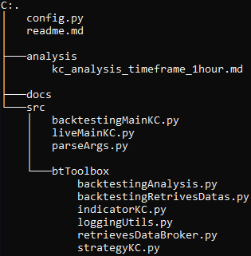

# Keltner Channels Strategy

## Introduction
This is version `0.0.1` of a trading strategy utilizing Keltner Channels, distinguished by its considerable flexibility in adjusting parameters directly from the terminal, eliminating the need to modify the source code.

The strategy is built on the `Backtrader` library and employs `CCXT` and `CCXTbt` as bridging components, facilitating seamless interaction with the broker.

Notably, this strategy supports both backtesting and live trading, offering the ability to switch between these functionalities by adjusting the `--live` parameter.

## Strategy
The Keltner Channel strategy is based on analyzing two lines that delineate a channel calculated based on the asset's behavior.

### Channel
The channel's size is determined by calculating the EMA (Exponential Moving Average), to which 2 times the ATR (Average True Range) is then added for the upper band or subtracted for the lower band.

### Entry and Exit Logic
- **Entry Conditions**:
  - Buy Signal:
  
    Generated when the closing price crosses above the upper band of the Keltner Channel (CrossOver BUY).
  - Sell Signal:
  
    Generated when the closing price crosses below the lower band of the Keltner Channel (CrossOver SELL).
  
- **Exit Conditions**:
  - Return within the Keltner Channel:
  
    If the position is already open, the exit occurs when the closing price re-enters within the channel.
  - Stop Loss:
    
    An alternative exit when the price reaches or surpasses the Stop Loss level calculated based on the opening price.

### Position Management
The size of positions and the risk associated with buy and sell orders are defined respectively by the `risk_amount_buy` and `risk_amount_sell` parameters as a percentage of available capital. The `order_params_buy` and `order_params_sell` parameters influence order price calculations.

## Code Structure

The project structure is organized hierarchically:
- The `analysis` folder contains detailed analysis of different parameter sets.
- The `docs` folder contains generated documentation using Sphinx.
- The `src` folder contains the source code.
- The `config.py` file holds personalized configurations for connecting to your broker.
- Files like `liveMainKC.py`, `parseArgs.py`, and `backtestingMainKC.py` handle live trading, parameter input, and backtesting respectively.
- The `btToolbox` package contains specific logics such as channel calculation, position management, data retrieval, and backtesting analysis.

This structure allows for clear and modular code management, dividing functionalities into distinct modules and packages.

## Parameter Customization Details

The Keltner Channel strategy offers a wide range of parameters enabling precise customization to adapt to various market conditions. Each parameter plays a crucial role in defining entry/exit logics and overall risk management.

- `periodEMA` and `periodATR`

    These parameters determine the EMA (Exponential Moving Average) and ATR (Average True Range) periods respectively. Adjusting these values can influence the strategy's sensitivity to price changes in the market. Longer periods generate more conservative signals, while shorter periods make the strategy more responsive to price changes.

- `riskAmountBuy` and `riskAmountSell`

    These parameters represent the percentage of available capital the strategy is willing to risk for each buy and sell operation. Changing these values can directly affect position sizing and overall risk level in executing operations. Higher values can increase profit potential but also entail higher risk.

- `stopprice`

    The stop-loss parameter determines the price level at which a position will be closed to limit losses. Increasing or decreasing this value can impact the degree of protection against adverse market movements. Tighter loss management might reduce overall losses but could also generate more exit signals.

- `orderParamBuy` and `orderParamSell`

    These parameters directly influence the price of buy and sell orders. Changing these values regulates the operations' sensitivity to price changes. A higher value might generate fewer trading signals but could require a longer wait for execution, while a lower value might generate more signals but result in less favorable execution.

Optimizing these parameters involves a delicate balance between risk and return. Testing different value combinations on historical data or in simulation mode can provide a clear overview of how the strategy would perform in various market contexts, enabling a more informed choice of parameters to optimize the strategy's performance.
