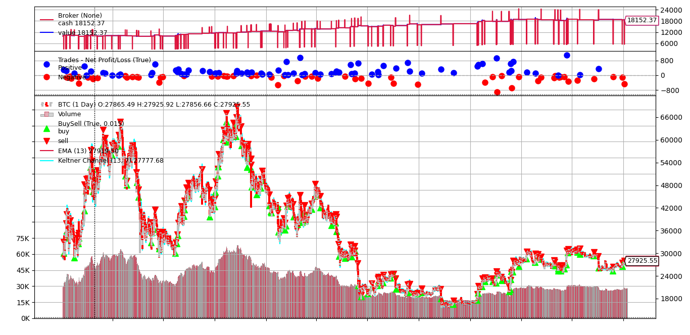

# Keltner Channels Analysis BTC/USDT

## What it is about:
This document provides an extensive analysis of a trading strategy utilizing Keltner Channels applied to BTC (Bitcoin), employing 1-hour Binance data from January 1st, 2021, to October 7th, 2023, extracted from the "binance.csv" file. The analysis centers on backtesting, factoring in a 0.1% transition commission to emulate Binance broker commission structure.

## Analysis:

### Backtrader Graph:

### Init

| INITIAL DEPOSIT   | DATE START DATA     | DATE END DATA       |   COMMISSION | CURRENCY TRADE   |
|:------------------|:--------------------|:--------------------|-------------:|:-----------------|
| $ 10000.0         | 2021-01-01 00:00:00 | 2023-10-07 00:00:00 |        0.001 | USDT             | 

| TIMEFRAME   |   EMA PERIOD |   ATR PERIOD |   BUY RISK AMOUNT |   SELL RISK AMOUNT |   STOP PRICE |
|:------------|-------------:|-------------:|------------------:|-------------------:|-------------:|
| 1h          |           13 |            7 |                70 |                 30 |         0.01 |

### End

| TOTAL PORTFOLIO VALUE   | TOTAL CASH   | TOTAL NET PROFIT   | TOTAL % NET PROFIT   | YEARLY AVG % RETURN   |   # OPEN TRADERS |   # CLOSED TRADERS |
|:------------------------|:-------------|:-------------------|:---------------------|:----------------------|-----------------:|-------------------:|
| $ 18152.37              | $ 18152.37   | $ 8152.37          | 81.52%               | 22.34%                |                0 |                137 |

|   SQN |   SHARPE RATIO ANNUAL | MAX DRAWDOWN   | MAX % DRAWDOWN   | ACTUAL DRAWDOWN   | ACTUAL % DRAWDOWN   |
|------:|----------------------:|:---------------|:-----------------|:------------------|:--------------------|
|   2.3 |                  2.34 | $ 1637.70      | 8.52%            | $ 1637.70         | 8.28%               |

|   YEAR | ANNUAL % RETURN WALLET   | BEGINNING-END OF YEAR   | ANNUAL MAX % RETURN ASSET   | ANNUAL MIN % RETURN ASSET   |
|-------:|:-------------------------|:------------------------|:----------------------------|:----------------------------|
|   2021 | 26.0%                    | 59.8%                   | 137.3%                      | 0.2%                        |
|   2022 | 31.2%                    | -64.2%                  | 3.8%                        | -66.1%                      |
|   2023 | 9.8%                     | 68.8%                   | 91.1%                       | -0.2%                       |

| Short   |   # Total Position | PNL Total   | PNL Max   |   Length of open positions |   Length Max |   Length Min |   Length AVG |
|:--------|-------------------:|:------------|:----------|---------------------------:|-------------:|-------------:|-------------:|
| Won     |                 25 | $ 4151.57   | $ 650.09  |                        347 |           29 |            3 |        13.88 |
| Lost    |                 26 | $ -2854.90  | $ -378.91 |                        310 |           24 |            3 |        11.92 |

| Long   |   # Total Position | PNL Total   | PNL Max   |   Length of open positions |   Length Max |   Length Min |   Length AVG |
|:-------|-------------------:|:------------|:----------|---------------------------:|-------------:|-------------:|-------------:|
| Won    |                 52 | $ 14561.89  | $ 1104.22 |                        895 |           33 |            2 |        17.21 |
| Lost   |                 34 | $ -7706.19  | $ -910.95 |                        400 |           31 |            1 |        11.76 | 

### General Analysis

The strategy exhibited remarkable performance, yielding an 81.52% net profit against an initial $10,000 deposit. Notably, the maximum drawdown observed at 8.52% signifies commendable risk management.

- **2021:** Despite the strategy's 26.0% profit, BTC/USDT outperformed with 59.8%. However, the strategy showed superior risk management, evident from BTC/USDT's drawdown of over 55%.

- **2022:** While the strategy yielded a 31.2% profit, BTC/USDT experienced a significant -64.2% decline. The strategy's ability to perform in negative markets was evident, recording slightly more losses than gains in short positions but with lower losses (\$ -2854.90 vs. \$ +4151.57).

- **2023:** The strategy recorded a modest 9.8% profit, contrasting BTC/USDT's 68% gain. Notably, 2023 experienced fewer market fluctuations, indicating that the Keltner Channel strategy performs better in markets with extreme price movements.

Additionally, open positions had a maximum duration of 33 hours and an average of about 13.69 hours, showcasing a balanced strategy that capitalizes on trading opportunities in both market directions.

In summary, this strategy demonstrated promising outcomes, boasting a Sharpe Ratio of 2.34 and an SQN of 2.3. Its performance appears independent of specific asset trends, displaying robust adaptability across diverse market conditions, and significantly superior risk management.

